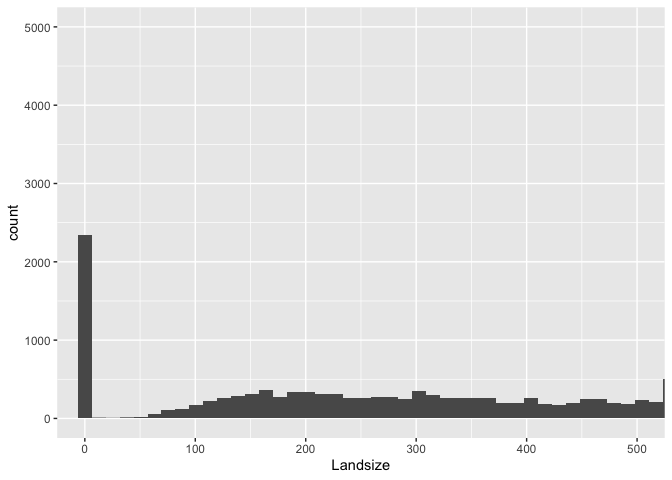
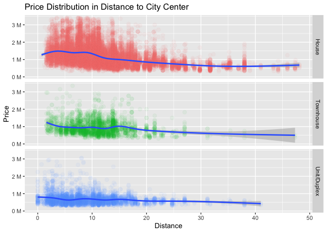

Melbourne Housing
================

- [1 Importing Dataset /
  Pre-analysis](#1-importing-dataset--pre-analysis)
- [2 Preparing Columns for Analysis](#2-preparing-columns-for-analysis)
  - [2.1 X Column](#21-x-column)
  - [2.2 Date Column](#22-date-column)
  - [2.3 Type Column](#23-type-column)
  - [2.4 Price Column](#24-price-column)
  - [2.5 Landsize and BuildingArea
    Columns](#25-landsize-and-buildingarea-columns)
  - [2.6 Rooms, Bathroom, Car Columns](#26-rooms-bathroom-car-columns)
  - [2.7 YearBuilt Column](#27-yearbuilt-column)
  - [2.8 Distance Column](#28-distance-column)
  - [2.9 Regionname Column](#29-regionname-column)
  - [2.10 PropertyCount Column](#210-propertycount-column)
- [3 Manually Replacing Missing
  Values](#3-manually-replacing-missing-values)
- [4 Outliers](#4-outliers)
  - [4.1 Price Column Outliers](#41-price-column-outliers)
  - [4.2 Landsize Column Outliers](#42-landsize-column-outliers)
  - [4.3 BuildingArea Column Outliers](#43-buildingarea-column-outliers)
  - [4.4 Rooms Column Outliers](#44-rooms-column-outliers)
  - [4.5 Bathroom Column Outliers](#45-bathroom-column-outliers)
  - [4.6 Car Column Outliers](#46-car-column-outliers)
  - [4.7 YearBuilt Column Outliers](#47-yearbuilt-column-outliers)
- [5 Replacing Missing Values Using “mice”
  Package](#5-replacing-missing-values-using-mice-package)
- [6 Analysis & Visualization](#6-analysis--visualization)
  - [6.1 Property Type Distribution (Pie
    Chart)](#61-property-type-distribution-pie-chart)
  - [6.2 Property Distribution per Region (Bar
    Chart)](#62-property-distribution-per-region-bar-chart)
  - [6.3 Landsize Distribution
    (Histogram)](#63-landsize-distribution-histogram)
  - [6.4 Price vs Distance per Type(Scatter
    Plot)](#64-price-vs-distance-per-typescatter-plot)
  - [6.5 Price Analysis](#65-price-analysis)
    - [6.5.1 Histogram](#651-histogram)
    - [6.5.2 Grouping Properties by
      Price](#652-grouping-properties-by-price)
    - [6.5.3 Type vs Price (Boxplot)](#653-type-vs-price-boxplot)
    - [6.5.4 Correlated Values](#654-correlated-values)

# 1 Importing Dataset / Pre-analysis

We are importing our dataset by using “read.csv” fuction. I decided to
use strings as non-factor objects because I will set all the variables
by myself after doing some analysis on data. Since we have some cells
with “\#N/A” text in it (according the info we got by analysing our
dataset externally), R doesn’t see them as NA values. To avoid them, we
will be using “na.strings” parameter to import them as NA’s.

``` r
housing_dataset <- read.csv("melbourne_data.csv",
                            stringsAsFactors = FALSE, na.strings = "#N/A")
```

Before doing any cleaning and altering on dataset, we will be checking
structure and summary of the dataset to have some idea about it.

``` r
str(housing_dataset)
```

    ## 'data.frame':    34857 obs. of  13 variables:
    ##  $ X            : int  1 2 3 4 5 6 7 8 9 10 ...
    ##  $ Date         : chr  "3/09/2016" "3/12/2016" "4/02/2016" "4/02/2016" ...
    ##  $ Type         : chr  "h" "h" "h" "u" ...
    ##  $ Price        : chr  "NA" "1480000" "1035000" "NA" ...
    ##  $ Landsize     : chr  "126" "202" "156" "0" ...
    ##  $ BuildingArea : chr  "NA" "NA" "79" "NA" ...
    ##  $ Rooms        : int  2 2 2 3 3 3 4 4 2 2 ...
    ##  $ Bathroom     : chr  "1" "1" "1" "2" ...
    ##  $ Car          : chr  "1" "1" "0" "1" ...
    ##  $ YearBuilt    : chr  "NA" "NA" "1900" "NA" ...
    ##  $ Distance     : num  2.5 2.5 2.5 2.5 2.5 2.5 2.5 2.5 2.5 2.5 ...
    ##  $ Regionname   : chr  "Northern Metropolitan" "Northern Metropolitan" "Northern Metropolitan" "Northern Metropolitan" ...
    ##  $ Propertycount: int  4019 4019 4019 4019 4019 4019 4019 4019 4019 4019 ...

When we check the structure of our dataset, we can see there is a column
named “X” which is unnecessary since we already have built in numbering
system in R. We have lots of columns which is “chr” type and it looks
incorrect. Since they are character, it won’t be healthy to check
summary of the dataset now. So we will work with our column types first.

# 2 Preparing Columns for Analysis

## 2.1 X Column

As we mentioned above we won’t use column X. According to that, we will
be removing that column from our dataset for further analysis.

``` r
housing_dataset$X <- NULL
```

## 2.2 Date Column

We are formatting the “Date” column to Date object, looking into the new
structure and summary to check everything is working as what we wanted.
Fortunately, we had no NA values in “Date” column.

``` r
housing_dataset$Date <- as.Date(housing_dataset$Date, format = "%d/%m/%Y")
```

``` r
str(housing_dataset$Date)
```

    ##  Date[1:34857], format: "2016-09-03" "2016-12-03" "2016-02-04" "2016-02-04" "2017-03-04" ...

``` r
summary(housing_dataset$Date)
```

    ##         Min.      1st Qu.       Median         Mean      3rd Qu.         Max. 
    ## "2016-01-28" "2016-11-19" "2017-07-08" "2017-05-23" "2017-10-28" "2018-03-17"

## 2.3 Type Column

We will be renaming strings for better explanation and factorizing those
values. Then we will check levels of created factor to ensure everything
is alright. After factorising, we will be looking into the new structure
and summary to ensure everything looks like as what we wanted. By
checking our summary report, we can see that we have no NA values in
“Type” column too.

``` r
housing_dataset$Type[housing_dataset$Type == "h"] <- "House"
housing_dataset$Type[housing_dataset$Type == "u"] <- "Unit/Duplex"
housing_dataset$Type[housing_dataset$Type == "t"] <- "Townhouse"
housing_dataset$Type <- factor(housing_dataset$Type)
```

``` r
levels(factor(housing_dataset$Type))
```

    ## [1] "House"       "Townhouse"   "Unit/Duplex"

``` r
str(housing_dataset$Type)
```

    ##  Factor w/ 3 levels "House","Townhouse",..: 1 1 1 3 1 1 1 1 1 1 ...

``` r
summary(housing_dataset$Type)
```

    ##       House   Townhouse Unit/Duplex 
    ##       23980        3580        7297

## 2.4 Price Column

We will be formatting “Price” column to integer since we don’t have any
double values in Price column. Then we will be checking the structure,
summary in the “Price” column. According to summary we got, we have 7610
missing values on “Price” column which we will work on them later.

``` r
housing_dataset$Price <- as.integer(housing_dataset$Price)
```

``` r
str(housing_dataset$Price)
```

    ##  int [1:34857] NA 1480000 1035000 NA 1465000 850000 1600000 NA NA NA ...

``` r
summary(housing_dataset$Price)
```

    ##     Min.  1st Qu.   Median     Mean  3rd Qu.     Max.     NA's 
    ##    85000   635000   870000  1050173  1295000 11200000     7610

## 2.5 Landsize and BuildingArea Columns

We will be formatting “Landsize” and “BuildingArea” columns to integer
since they are sharing the same structure and we don’t have any double
values in them. Then, we will check the structure, summary and extract
NA values by reading summary report. We have 11810 missing values on
“Landsize” and 21115 missing values on “BuildingArea” column.

``` r
housing_dataset$Landsize <- as.integer(housing_dataset$Landsize)
housing_dataset$BuildingArea <- as.integer(housing_dataset$BuildingArea)
```

``` r
str(housing_dataset$Landsize)
```

    ##  int [1:34857] 126 202 156 0 134 94 120 400 201 202 ...

``` r
summary(housing_dataset$Landsize)
```

    ##     Min.  1st Qu.   Median     Mean  3rd Qu.     Max.     NA's 
    ##      0.0    224.0    521.0    593.6    670.0 433014.0    11810

``` r
str(housing_dataset$BuildingArea)
```

    ##  int [1:34857] NA NA 79 NA 150 NA 142 220 NA NA ...

``` r
summary(housing_dataset$BuildingArea)
```

    ##    Min. 1st Qu.  Median    Mean 3rd Qu.    Max.    NA's 
    ##     0.0   102.0   136.0   160.2   188.0 44515.0   21115

## 2.6 Rooms, Bathroom, Car Columns

We will apply the same approach to “Rooms”, “Bathroom”, and “Car”
columns since they have identical structure in terms of data. First of
all, we will format them to integer and then we will be checking their
structures and summaries one by one. Fortunately, we have no NA values
in “Rooms” column but we have 8226 missing values in “Bathroom” and 8728
missing values in “Car” column.

``` r
housing_dataset$Rooms <- as.integer(housing_dataset$Rooms)
housing_dataset$Bathroom <- as.integer(housing_dataset$Bathroom)
housing_dataset$Car <- as.integer(housing_dataset$Car)
```

``` r
str(housing_dataset$Rooms)
```

    ##  int [1:34857] 2 2 2 3 3 3 4 4 2 2 ...

``` r
summary(housing_dataset$Rooms)
```

    ##    Min. 1st Qu.  Median    Mean 3rd Qu.    Max. 
    ##   1.000   2.000   3.000   3.031   4.000  16.000

``` r
str(housing_dataset$Bathroom)
```

    ##  int [1:34857] 1 1 1 2 2 2 1 2 1 2 ...

``` r
summary(housing_dataset$Bathroom)
```

    ##    Min. 1st Qu.  Median    Mean 3rd Qu.    Max.    NA's 
    ##   0.000   1.000   2.000   1.625   2.000  12.000    8226

``` r
str(housing_dataset$Car)
```

    ##  int [1:34857] 1 1 0 1 0 1 2 2 2 1 ...

``` r
summary(housing_dataset$Car)
```

    ##    Min. 1st Qu.  Median    Mean 3rd Qu.    Max.    NA's 
    ##   0.000   1.000   2.000   1.729   2.000  26.000    8728

## 2.7 YearBuilt Column

We will format “YearBuilt” column to integer. Since we don’t have any
month and day information in this column, we don’t need to use it as
Date object. After formatting, we will be checking the structure and
summary of this column. As we can see from summary report below, we have
19306 missing values in this column.

``` r
housing_dataset$YearBuilt <- as.integer(housing_dataset$YearBuilt)
```

``` r
str(housing_dataset$YearBuilt)
```

    ##  int [1:34857] NA NA 1900 NA 1900 NA 2014 2006 1900 1900 ...

``` r
summary(housing_dataset$YearBuilt)
```

    ##    Min. 1st Qu.  Median    Mean 3rd Qu.    Max.    NA's 
    ##    1196    1940    1970    1965    2000    2106   19306

## 2.8 Distance Column

We are formatting “Distance” column to numeric since we have digits in
those columns. Then we are checking structure and summary as always. We
have just 1 cell missing in “Distance” column.

``` r
housing_dataset$Distance <- as.numeric(housing_dataset$Distance)
```

``` r
str(housing_dataset$Distance)
```

    ##  num [1:34857] 2.5 2.5 2.5 2.5 2.5 2.5 2.5 2.5 2.5 2.5 ...

``` r
summary(housing_dataset$Distance)
```

    ##    Min. 1st Qu.  Median    Mean 3rd Qu.    Max.    NA's 
    ##    0.00    6.40   10.30   11.18   14.00   48.10       1

## 2.9 Regionname Column

We will be factorizing the “Regionname” column and checking its levels
after. Then, we will look into structure and summary of it to be sure
everything is correct. According to summary, we have 3 cells missing in
“Regionname” column.

``` r
housing_dataset$Regionname <- factor(housing_dataset$Regionname)
```

``` r
levels(factor(housing_dataset$Regionname))
```

    ## [1] "Eastern Metropolitan"       "Eastern Victoria"          
    ## [3] "Northern Metropolitan"      "Northern Victoria"         
    ## [5] "South-Eastern Metropolitan" "Southern Metropolitan"     
    ## [7] "Western Metropolitan"       "Western Victoria"

``` r
str(housing_dataset$Regionname)
```

    ##  Factor w/ 8 levels "Eastern Metropolitan",..: 3 3 3 3 3 3 3 3 3 3 ...

``` r
summary(housing_dataset$Regionname)
```

    ##       Eastern Metropolitan           Eastern Victoria 
    ##                       4377                        228 
    ##      Northern Metropolitan          Northern Victoria 
    ##                       9557                        203 
    ## South-Eastern Metropolitan      Southern Metropolitan 
    ##                       1739                      11836 
    ##       Western Metropolitan           Western Victoria 
    ##                       6799                        115 
    ##                       NA's 
    ##                          3

## 2.10 PropertyCount Column

We will factorize the “PropertyCount” column because those values
actually are not different from each other. There are several property
areas in different regions which has exactly the same amount of
properties. So, they show us “which” property area that property belongs
to. According to that, we will use that variable as factor, instead of
integer. Then we are checking its structure and summary. We have 3
missing rows in “PropertyCount” column, same as “Regionname” according
to summaries we got.

``` r
housing_dataset$Propertycount <- factor(housing_dataset$Propertycount)
```

``` r
levels(factor(housing_dataset$Propertycount))
```

*Output of levels are not included since there are so many different
levels. You can remove ‘results’ parameter in code block above to see
output.*

``` r
str(housing_dataset$Propertycount)
```

    ##  Factor w/ 342 levels "83","121","129",..: 185 185 185 185 185 185 185 185 185 185 ...

``` r
summary(housing_dataset$Propertycount)
```

    ##   21650    8870   10969   14949   10412   14577   10331   10579   11918   14887 
    ##     844     722     583     552     491     485     467     456     444     435 
    ##   11308   11364    8920    7809    9264   11204    6938    7485   13240    8648 
    ##     428     424     422     420     409     405     393     378     374     371 
    ##    8801    7717    5682    6795    6543    7082    5457    8989    6232    6482 
    ##     369     336     319     319     304     304     293     288     285     284 
    ##    5454    7217    7822    7570    9028   15510    5498    6567   13366    4836 
    ##     281     278     277     262     257     255     251     249     241     237 
    ##    5678   15321    5549    5629    4918    4675    5420    5070    6380   17496 
    ##     237     235     234     232     228     222     212     211     210     204 
    ##    5058    5263    3755    6763    5943    5533   13830    6244   16166   10529 
    ##     201     199     198     197     194     186     186     184     178     176 
    ##    3873    3284    4442    3540   10175   10926    5132    4502    3464    9758 
    ##     175     174     173     172     172     171     167     163     162     162 
    ##    4480    6821    3052   14092    3578    3445    4217    2947    5825    2674 
    ##     160     159     157     157     153     151     151     150     150     149 
    ##   14042   10999    2291    8524    2954    3265    4019    2894    2651    2671 
    ##     146     145     144     142     140     137     137     136     135     134 
    ##    3692   11925    4898    4380    3280   15542    2555    4553 (Other)    NA's 
    ##     134     134     133     132     131     129     126     124    9871       3

# 3 Manually Replacing Missing Values

First, let’s have a look the data we have obtained during the
pre-process.

Date Column: 0 missing rows Type Column: 0 missing rows Price Column:
7610 missing rows Landsize Column: 11810 missing rows BuildingArea
Column: 21115 missing rows Rooms Column: 0 missing rows Bathroom Column:
8226 missing rows Car Column: 8728 missing rows earBuilt Column: 19306
missing rows Distance Column: 1 missing rows Regionname Column: 3
missing rows Propertycount Column: 3 missing rows

When we look at the table above, we can see that the Distance,
Regionname and Propertycount columns have very little missing data.
Starting from this data will be the easiest step for us since they won’t
require any prediction. It would be more effective to use prediction
since there are only 3 missing rows and rest of the data could be used
for training our model. However, the purpose of the project is trying to
apply different approaches and hands-on experiences as much as possible
so we will stick with manual analysis.

``` r
housing_dataset[is.na(housing_dataset$Distance), ]
```

    ##             Date  Type  Price Landsize BuildingArea Rooms Bathroom Car
    ## 29484 2018-01-06 House 616000       NA           NA     3       NA  NA
    ##       YearBuilt Distance Regionname Propertycount
    ## 29484        NA       NA       <NA>          <NA>

``` r
housing_dataset[is.na(housing_dataset$Regionname), ]
```

    ##             Date        Type  Price Landsize BuildingArea Rooms Bathroom Car
    ## 18524 2017-07-15 Unit/Duplex 710000       NA           NA     2       NA  NA
    ## 26889 2017-11-11       House 825000       NA           NA     2       NA  NA
    ## 29484 2018-01-06       House 616000       NA           NA     3       NA  NA
    ##       YearBuilt Distance Regionname Propertycount
    ## 18524        NA      5.1       <NA>          <NA>
    ## 26889        NA      7.7       <NA>          <NA>
    ## 29484        NA       NA       <NA>          <NA>

``` r
housing_dataset[is.na(housing_dataset$Propertycount), ]
```

    ##             Date        Type  Price Landsize BuildingArea Rooms Bathroom Car
    ## 18524 2017-07-15 Unit/Duplex 710000       NA           NA     2       NA  NA
    ## 26889 2017-11-11       House 825000       NA           NA     2       NA  NA
    ## 29484 2018-01-06       House 616000       NA           NA     3       NA  NA
    ##       YearBuilt Distance Regionname Propertycount
    ## 18524        NA      5.1       <NA>          <NA>
    ## 26889        NA      7.7       <NA>          <NA>
    ## 29484        NA       NA       <NA>          <NA>

It seems that these 3 columns are missing 3 rows in common. We have the
“Distance” data in the 2 missing rows, and as we know, the “Distance”,
“Regionname”, and “Propertycount” columns are there to provide the same
information: the area where the property is located. With that in mind,
we can use this “Distance” data to predict other columns.

First, let’s take a look at the regions where the “Distance” data is
5.1.

``` r
summary(housing_dataset$Regionname[housing_dataset$Distance == 5.1])
```

    ##       Eastern Metropolitan           Eastern Victoria 
    ##                          0                          0 
    ##      Northern Metropolitan          Northern Victoria 
    ##                          0                          0 
    ## South-Eastern Metropolitan      Southern Metropolitan 
    ##                          0                         76 
    ##       Western Metropolitan           Western Victoria 
    ##                        170                          0 
    ##                       NA's 
    ##                          2

When we perform some mathematical operations on the above data, we
obtain the Regionname value of the first row can be Western Metropolitan
with a probability of 69.1%, or Southern Metropolitan with a probability
of 30.9%. Accordingly, instead of deleting this data, we can add it to
the analysis by restoring it. Using prediction models could be more
accurate with this type of probability since we could include more
informations into calculation.

``` r
housing_dataset[18524, "Regionname"] <- "Western Metropolitan"
```

Now let’s do the same steps for second line and see if we can get any
better probability.

``` r
summary(housing_dataset$Regionname[housing_dataset$Distance == 7.7])
```

    ##       Eastern Metropolitan           Eastern Victoria 
    ##                          0                          0 
    ##      Northern Metropolitan          Northern Victoria 
    ##                          0                          0 
    ## South-Eastern Metropolitan      Southern Metropolitan 
    ##                          0                        352 
    ##       Western Metropolitan           Western Victoria 
    ##                         31                          0 
    ##                       NA's 
    ##                          2

When we do the same operations on the second line, we get the Southern
Metropolitan value with a probability of 91.9% and a Western
Metropolitan value with a probability of 8.1%. Based on this
information, we can assume the Regionname of second line to be Southern
Metropolitan and include it in the analysis.

``` r
housing_dataset[26889, "Regionname"] <- "Southern Metropolitan"
```

We can do a similar approach for the “Propertycount” column. If we
examine the property area where the properties are located in that
region and include the house prices in this examination, we can find
where these properties belong.

``` r
summary(housing_dataset$Propertycount[housing_dataset$Distance == 5.1 &
                                      housing_dataset$Regionname == "Western Metropolitan"])
```

    ##    7570    2417      83     121     129     242     249     271     290     335 
    ##     119      51       0       0       0       0       0       0       0       0 
    ##     342     389     394     438     457     534     538     570     588     604 
    ##       0       0       0       0       0       0       0       0       0       0 
    ##     608     642     709     768     777     790     794     802     810     821 
    ##       0       0       0       0       0       0       0       0       0       0 
    ##     845     849     851     852     869     892     902     915     938     962 
    ##       0       0       0       0       0       0       0       0       0       0 
    ##     973     984    1008    1048    1052    1058    1071    1119    1123    1124 
    ##       0       0       0       0       0       0       0       0       0       0 
    ##    1130    1158    1160    1184    1202    1223    1240    1281    1308    1328 
    ##       0       0       0       0       0       0       0       0       0       0 
    ##    1345    1369    1390    1414    1424    1442    1475    1490    1543    1554 
    ##       0       0       0       0       0       0       0       0       0       0 
    ##    1588    1595    1607    1624    1651    1686    1690    1705    1721    1793 
    ##       0       0       0       0       0       0       0       0       0       0 
    ##    1808    1863    1889    1899    1989    1999    2003    2004    2019    2076 
    ##       0       0       0       0       0       0       0       0       0       0 
    ##    2079    2126    2170    2185    2206    2211    2230    2243 (Other)    NA's 
    ##       0       0       0       0       0       0       0       0       0       2

When we look at the table above, we can say that this property is more
likely to be located in the area with 7570 properties. However, it is
also useful to bring the “price” value into consideration.

``` r
housing_dataset[18524, "Price"]
```

    ## [1] 710000

``` r
summary(housing_dataset$Price[housing_dataset$Distance == 5.1 &
                              housing_dataset$Regionname == "Western Metropolitan" &
                              housing_dataset$Propertycount == 7570])
```

    ##    Min. 1st Qu.  Median    Mean 3rd Qu.    Max.    NA's 
    ##  170000  453750  800000  736400  919000 1560000      21

``` r
summary(housing_dataset$Price[housing_dataset$Distance == 5.1 &
                              housing_dataset$Regionname == "Western Metropolitan" &
                              housing_dataset$Propertycount == 2417])
```

    ##    Min. 1st Qu.  Median    Mean 3rd Qu.    Max.    NA's 
    ##  322500  853000  985000 1003046 1129250 1870000       9

The value of this property is defined as 710.000 units and if we look at
the mean and median price values in two different fields, the arrows
again shows the field with 7570 properties. With this information, we
edit the “Propertycount” of this property as “7570” and include it in
our analysis.

``` r
housing_dataset[18524, "Propertycount"] <- 7570
```

Now let’s do the same approach for the second row.

``` r
summary(housing_dataset$Propertycount[housing_dataset$Distance == 7.7 &
                                      housing_dataset$Regionname == "Southern Metropolitan"])
```

    ##    8920    8989      83     121     129     242     249     271     290     335 
    ##     196     156       0       0       0       0       0       0       0       0 
    ##     342     389     394     438     457     534     538     570     588     604 
    ##       0       0       0       0       0       0       0       0       0       0 
    ##     608     642     709     768     777     790     794     802     810     821 
    ##       0       0       0       0       0       0       0       0       0       0 
    ##     845     849     851     852     869     892     902     915     938     962 
    ##       0       0       0       0       0       0       0       0       0       0 
    ##     973     984    1008    1048    1052    1058    1071    1119    1123    1124 
    ##       0       0       0       0       0       0       0       0       0       0 
    ##    1130    1158    1160    1184    1202    1223    1240    1281    1308    1328 
    ##       0       0       0       0       0       0       0       0       0       0 
    ##    1345    1369    1390    1414    1424    1442    1475    1490    1543    1554 
    ##       0       0       0       0       0       0       0       0       0       0 
    ##    1588    1595    1607    1624    1651    1686    1690    1705    1721    1793 
    ##       0       0       0       0       0       0       0       0       0       0 
    ##    1808    1863    1889    1899    1989    1999    2003    2004    2019    2076 
    ##       0       0       0       0       0       0       0       0       0       0 
    ##    2079    2126    2170    2185    2206    2211    2230    2243 (Other)    NA's 
    ##       0       0       0       0       0       0       0       0       0       2

It is very difficult to make a prediction based on the above table.
There are almost equal number of properties in 2 different regions.
Therefore, we will try to predict it based on the price values.

``` r
housing_dataset[26889, "Price"]
```

    ## [1] 825000

``` r
summary(housing_dataset$Price[housing_dataset$Distance == 7.7 &
                              housing_dataset$Regionname == "Southern Metropolitan" &
                              housing_dataset$Propertycount == 8920])
```

    ##    Min. 1st Qu.  Median    Mean 3rd Qu.    Max.    NA's 
    ##  410000 1205000 1845000 1874412 2396250 6000000      60

``` r
summary(housing_dataset$Price[housing_dataset$Distance == 7.7 &
                              housing_dataset$Regionname == "Southern Metropolitan" &
                              housing_dataset$Propertycount == 8989])
```

    ##    Min. 1st Qu.  Median    Mean 3rd Qu.    Max.    NA's 
    ##  300000  559000  685000  931183 1180000 3572000      49

The value of our second property is defined as 825.000 units. When we
look at the mean and median values in two different area, we can easily
say that this property belongs to the second area. Therefore, we change
the “Propertycount” data of this property to “8989”.

``` r
housing_dataset[26889, "Propertycount"] <- 8989
```

We recovered two of the 3 missing rows. Let’s take a look at the third
one.

``` r
housing_dataset[29484, ]
```

    ##             Date  Type  Price Landsize BuildingArea Rooms Bathroom Car
    ## 29484 2018-01-06 House 616000       NA           NA     3       NA  NA
    ##       YearBuilt Distance Regionname Propertycount
    ## 29484        NA       NA       <NA>          <NA>

Unfortunately there is nothing we can do for this row. While we only
have the number of rooms and the price, there is no way we can recover
such missing data. Therefore, we will not include this row in our
analysis.

``` r
housing_dataset <- housing_dataset[-c(29484), ]
```

Before concluding this section, let’s take a final look at a summary of
our data.

``` r
summary(housing_dataset)
```

    ##       Date                     Type           Price             Landsize       
    ##  Min.   :2016-01-28   House      :23979   Min.   :   85000   Min.   :     0.0  
    ##  1st Qu.:2016-11-19   Townhouse  : 3580   1st Qu.:  635000   1st Qu.:   224.0  
    ##  Median :2017-07-08   Unit/Duplex: 7297   Median :  870000   Median :   521.0  
    ##  Mean   :2017-05-23                       Mean   : 1050189   Mean   :   593.6  
    ##  3rd Qu.:2017-10-28                       3rd Qu.: 1295000   3rd Qu.:   670.0  
    ##  Max.   :2018-03-17                       Max.   :11200000   Max.   :433014.0  
    ##                                           NA's   :7610       NA's   :11809     
    ##   BuildingArea         Rooms           Bathroom           Car        
    ##  Min.   :    0.0   Min.   : 1.000   Min.   : 0.000   Min.   : 0.000  
    ##  1st Qu.:  102.0   1st Qu.: 2.000   1st Qu.: 1.000   1st Qu.: 1.000  
    ##  Median :  136.0   Median : 3.000   Median : 2.000   Median : 2.000  
    ##  Mean   :  160.2   Mean   : 3.031   Mean   : 1.625   Mean   : 1.729  
    ##  3rd Qu.:  188.0   3rd Qu.: 4.000   3rd Qu.: 2.000   3rd Qu.: 2.000  
    ##  Max.   :44515.0   Max.   :16.000   Max.   :12.000   Max.   :26.000  
    ##  NA's   :21114                      NA's   :8225     NA's   :8727    
    ##    YearBuilt        Distance                          Regionname   
    ##  Min.   :1196    Min.   : 0.00   Southern Metropolitan     :11837  
    ##  1st Qu.:1940    1st Qu.: 6.40   Northern Metropolitan     : 9557  
    ##  Median :1970    Median :10.30   Western Metropolitan      : 6800  
    ##  Mean   :1965    Mean   :11.18   Eastern Metropolitan      : 4377  
    ##  3rd Qu.:2000    3rd Qu.:14.00   South-Eastern Metropolitan: 1739  
    ##  Max.   :2106    Max.   :48.10   Eastern Victoria          :  228  
    ##  NA's   :19305                   (Other)                   :  318  
    ##  Propertycount  
    ##  21650  :  844  
    ##  8870   :  722  
    ##  10969  :  583  
    ##  14949  :  552  
    ##  10412  :  491  
    ##  14577  :  485  
    ##  (Other):31179

# 4 Outliers

Since the other columns has high amount of missing values, before doing
any approach to them we will get rid of the outliers which will help us
to eliminate some of the missing values and give us an opportunity to
predict some of those missing values. With outliers, our predictions
might get affected and give misleading results.

Values that we call “outlier”, which are very high or very low than the
other values in the category it is in, may affect the values we will
obtain from that category and may cause us to make an incorrect
analysis. These data may be true or false, but we will exclude this data
from our analysis as it will have a negative impact on our analysis no
matter what. We will make use of the quantile function and the filtering
method when applying this process.

## 4.1 Price Column Outliers

First of all, let’s examine the data in 1% and 99% percentile and make
sure there is no problem.

``` r
quantile(housing_dataset$Price, 0.99, na.rm = TRUE)
```

    ##     99% 
    ## 3400550

``` r
quantile(housing_dataset$Price, 0.01, na.rm = TRUE)
```

    ##     1% 
    ## 310000

For “Price” column we got 3.400.550 for upper and 310.000 for lower
values. Upper percentile value seems higher than expected so we might
need to do something different for “Price” column. To be sure, we will
check the “Price” values in histogram plot. To do that, we will use
ggplot2 and scales package and create a histogram chart from the data we
have. To get a better chart, we increase the number of bins to 100 and
focus on the X-axis between 0 and 5,000,000. Through the Scales package,
we ensure that the data on the X axis appear in a smoother format.

``` r
library(ggplot2)
library(scales)
```

``` r
ggplot(data = housing_dataset, aes(x = Price)) +
  geom_histogram(bins = 100) +
  coord_cartesian(xlim = c(0, 5000000)) +
  scale_x_continuous(labels = unit_format(unit = "M", scale = 1e-6))
```

<!-- -->

According to plot we got, we can see there are prices goes up to 5
million in the plot, so we can say that 3.400.550 is an acceptable value
for price. According to that information, we can exclude data below 1%
and above 99% from our analysis. Since we do not want to get rid of
missing values yet, we include missing values in our filter by using OR
operator.

``` r
housing_dataset <- housing_dataset[(housing_dataset$Price <= quantile(housing_dataset$Price, 0.99, na.rm = TRUE) |
                                    is.na(housing_dataset$Price)), ]
housing_dataset <- housing_dataset[(housing_dataset$Price >= quantile(housing_dataset$Price, 0.01, na.rm = TRUE) |
                                    is.na(housing_dataset$Price)), ]
```

## 4.2 Landsize Column Outliers

Let’s first take a look at the quantile values, as we just did.

``` r
quantile(housing_dataset$Landsize, 0.99, na.rm = TRUE)
```

    ##     99% 
    ## 2980.52

``` r
quantile(housing_dataset$Landsize, 0.01, na.rm = TRUE)
```

    ## 1% 
    ##  0

In “Landsize” column, we got 2980.52 for upper value and 0 for lower
value. Now, we need to do something different because “Landsize” cannot
be 0, that means there is something wrong in our data. To be sure, we
will check the distribution of “Landsize” column in histogram.

``` r
ggplot(data = housing_dataset, aes(x = Landsize)) +
  geom_histogram(bins = nrow(housing_dataset)) +
  coord_cartesian(xlim = c(0, 500), ylim = c(0, 5000))
```

<!-- -->

As we can see in the histogram, there are more than 2000 rows which has
0 value in Landsize row. Because of that, we are getting 0 as lower
percentile. To avoid that, we will remove the lines with 0 values in
their Landsize column.

``` r
housing_dataset <- housing_dataset[housing_dataset$Landsize > 0 | is.na(housing_dataset$Landsize), ]
```

``` r
quantile(housing_dataset$Landsize, 0.99, na.rm = TRUE)
```

    ##    99% 
    ## 3439.6

``` r
quantile(housing_dataset$Landsize, 0.01, na.rm = TRUE)
```

    ## 1% 
    ## 81

After that operation, we got 81 as lower percentile and 3439.6 as upper
percentile which is acceptable. Now we can apply the same method that we
were using to “Landsize” column.

``` r
housing_dataset <- housing_dataset[(housing_dataset$Landsize < quantile(housing_dataset$Landsize, 0.99, na.rm = TRUE) |
                                    is.na(housing_dataset$Landsize)), ]
housing_dataset <- housing_dataset[(housing_dataset$Landsize > quantile(housing_dataset$Landsize, 0.01, na.rm = TRUE) |
                                    is.na(housing_dataset$Landsize)), ]
```

## 4.3 BuildingArea Column Outliers

As always, we will be starting with checking percentile values.

``` r
quantile(housing_dataset$BuildingArea, 0.99, na.rm = TRUE)
```

    ##    99% 
    ## 484.42

``` r
quantile(housing_dataset$BuildingArea, 0.01, na.rm = TRUE)
```

    ##   1% 
    ## 3.43

We have similar problem with “BuildingArea” column. We are getting
484.42 as upper value but 3.43 as lower value and we know that
BuildingArea cannot be 3.43, so probably there are some incorrect values
which is stacked on low values. To approve that we will check
BuildingArea column in chart.

``` r
ggplot(data = housing_dataset, aes(x = BuildingArea)) +
  geom_histogram(bins = nrow(housing_dataset)) +
  coord_cartesian(xlim = c(0, 200), ylim = c(0, 300))
```

    ## Warning: Removed 19528 rows containing non-finite values (`stat_bin()`).

<!-- -->

As we can see in the chart, there are stacking near value 0. We will
zoom more to see the problem more detailed.

``` r
ggplot(data = housing_dataset, aes(x = BuildingArea)) +
  geom_histogram(bins = nrow(housing_dataset)) +
  coord_cartesian(xlim = c(0, 10), ylim = c(0, 100))
```

<!-- -->

We can see some stacking between 0 and 7, so we will cut the values
which has less than 7. After that, we can continue.

``` r
housing_dataset <- housing_dataset[housing_dataset$BuildingArea > 5 | is.na(housing_dataset$BuildingArea), ]
```

``` r
quantile(housing_dataset$BuildingArea, 0.99, na.rm = TRUE)
```

    ##    99% 
    ## 488.72

``` r
quantile(housing_dataset$BuildingArea, 0.01, na.rm = TRUE)
```

    ##    1% 
    ## 43.14

Now, we got 43.14 as lower value and 488.72 as upper value which is
acceptable. Now we can apply our method on BuildingArea column.

``` r
housing_dataset <- housing_dataset[(housing_dataset$BuildingArea < quantile(housing_dataset$BuildingArea, 0.99, na.rm = TRUE) |
                                    is.na(housing_dataset$BuildingArea)), ]
housing_dataset <- housing_dataset[(housing_dataset$BuildingArea > quantile(housing_dataset$BuildingArea, 0.01, na.rm = TRUE) |
                                    is.na(housing_dataset$BuildingArea)), ]
```

While checking our dataset, I detected some rows which has bigger
building areas than landsizes which is unrealistic. So, we will exclude
those rows aswell.

``` r
housing_dataset <- housing_dataset[housing_dataset$BuildingArea < housing_dataset$Landsize |
                                  is.na(housing_dataset$BuildingArea) |
                                  is.na(housing_dataset$Landsize), ]
```

## 4.4 Rooms Column Outliers

Let’s start with checking our percentile values.

``` r
quantile(housing_dataset$Rooms, 0.99, na.rm = TRUE)
```

    ## 99% 
    ##   5

``` r
quantile(housing_dataset$Rooms, 0.01, na.rm = TRUE)
```

    ## 1% 
    ##  1

When we check the quantile values for Rooms column, we we will see 5 for
upper and 1 for lower percentile which is acceptable and realistic, so
we will apply the same approach but we won’t include is.na() filtersince
Rooms column doesn’t have any missing values in it.

``` r
housing_dataset <- housing_dataset[housing_dataset$Rooms <= quantile(housing_dataset$Rooms, 0.99, na.rm = TRUE), ]
housing_dataset <- housing_dataset[housing_dataset$Rooms >= quantile(housing_dataset$Rooms, 0.01, na.rm = TRUE), ]
```

## 4.5 Bathroom Column Outliers

Once again, we look at quantile values first.

``` r
quantile(housing_dataset$Bathroom, 0.99, na.rm = TRUE)
```

    ## 99% 
    ##   4

``` r
quantile(housing_dataset$Bathroom, 0.01, na.rm = TRUE)
```

    ## 1% 
    ##  1

When we get the %99 and %1 percentile values of “Bathroom” values, it
returns us 4 and 1. We will exclude properties which has less than 1 and
more than 4 bathrooms in it.

``` r
housing_dataset <- housing_dataset[(housing_dataset$Bathroom <= quantile(housing_dataset$Bathroom, 0.99, na.rm = TRUE) | is.na(housing_dataset$Bathroom)), ]
housing_dataset <- housing_dataset[(housing_dataset$Bathroom >= quantile(housing_dataset$Bathroom, 0.01, na.rm = TRUE) | is.na(housing_dataset$Bathroom)), ]
```

## 4.6 Car Column Outliers

We start with quantile as usual:

``` r
quantile(housing_dataset$Car, 0.99, na.rm = TRUE)
```

    ## 99% 
    ##   5

``` r
quantile(housing_dataset$Car, 0.01, na.rm = TRUE)
```

    ## 1% 
    ##  0

In “Car” column, we get the 5 for upper percentile and 0 for lower
percentile. It’s acceptable because some houses may not have car parks.
According to that we will apply the same approach to “Car” column.

``` r
housing_dataset <- housing_dataset[(housing_dataset$Car <= quantile(housing_dataset$Car, 0.99, na.rm = TRUE) |
                                  is.na(housing_dataset$Car)), ]
housing_dataset <- housing_dataset[(housing_dataset$Car >= quantile(housing_dataset$Car, 0.01, na.rm = TRUE) |
                                  is.na(housing_dataset$Car)), ]
```

## 4.7 YearBuilt Column Outliers

We look at the quantile values one last time.

``` r
quantile(housing_dataset$YearBuilt, 0.99, na.rm = TRUE)
```

    ##  99% 
    ## 2016

``` r
quantile(housing_dataset$YearBuilt, 0.01, na.rm = TRUE)
```

    ##   1% 
    ## 1880

We will be applying same method to YearBuilt column because we get
meaningful quantile results like 1880 to 2016.

``` r
housing_dataset <- housing_dataset[(housing_dataset$YearBuilt <= quantile(housing_dataset$YearBuilt, 0.99, na.rm = TRUE) |
                                  is.na(housing_dataset$YearBuilt)), ]
housing_dataset <- housing_dataset[(housing_dataset$YearBuilt >= quantile(housing_dataset$YearBuilt, 0.01, na.rm = TRUE) |
                                  is.na(housing_dataset$YearBuilt)), ]
```

Before we end this section, let’s look at the summary of our data again
and make sure that everything is as we want.

``` r
summary(housing_dataset)
```

    ##       Date                     Type           Price            Landsize     
    ##  Min.   :2016-01-28   House      :22243   Min.   : 310000   Min.   :  82.0  
    ##  1st Qu.:2016-12-03   Townhouse  : 3149   1st Qu.: 660000   1st Qu.: 316.0  
    ##  Median :2017-07-29   Unit/Duplex: 4857   Median : 897000   Median : 557.0  
    ##  Mean   :2017-06-07                       Mean   :1044324   Mean   : 544.2  
    ##  3rd Qu.:2017-11-11                       3rd Qu.:1300000   3rd Qu.: 684.0  
    ##  Max.   :2018-03-17                       Max.   :3400000   Max.   :3434.0  
    ##                                           NA's   :6662      NA's   :11425   
    ##   BuildingArea       Rooms          Bathroom          Car       
    ##  Min.   : 44.0   Min.   :1.000   Min.   :1.000   Min.   :0.000  
    ##  1st Qu.:110.0   1st Qu.:3.000   1st Qu.:1.000   1st Qu.:1.000  
    ##  Median :141.0   Median :3.000   Median :2.000   Median :2.000  
    ##  Mean   :157.6   Mean   :3.083   Mean   :1.622   Mean   :1.752  
    ##  3rd Qu.:190.0   3rd Qu.:4.000   3rd Qu.:2.000   3rd Qu.:2.000  
    ##  Max.   :481.0   Max.   :5.000   Max.   :4.000   Max.   :5.000  
    ##  NA's   :19253                   NA's   :8050    NA's   :8497   
    ##    YearBuilt        Distance                          Regionname  
    ##  Min.   :1880    Min.   : 0.00   Southern Metropolitan     :9660  
    ##  1st Qu.:1940    1st Qu.: 7.00   Northern Metropolitan     :8232  
    ##  Median :1970    Median :10.70   Western Metropolitan      :6106  
    ##  Mean   :1963    Mean   :11.66   Eastern Metropolitan      :4107  
    ##  3rd Qu.:1996    3rd Qu.:14.30   South-Eastern Metropolitan:1655  
    ##  Max.   :2016    Max.   :48.10   Eastern Victoria          : 206  
    ##  NA's   :17713                   (Other)                   : 283  
    ##  Propertycount  
    ##  21650  :  788  
    ##  8870   :  646  
    ##  10969  :  559  
    ##  14577  :  443  
    ##  10412  :  425  
    ##  14949  :  410  
    ##  (Other):26978

Everything looks good. Then we can begin to dealing with our missing
data.

# 5 Replacing Missing Values Using “mice” Package

In this section, we will mainly use the “mice” package. To speak
briefly, the “mice” package implements a method to deal with missing
data. The package creates multiple imputations (replacement values) for
multivariate missing data. The method is based on Fully Conditional
Specification, where each incomplete variable is imputed by a separate
model. The “mice” algorithm can impute mixes of continuous, binary,
unordered categorical and ordered categorical data. In addition, “mice”
can impute continuous two-level data, and maintain consistency between
imputations by means of passive imputation. Many diagnostic plots are
implemented to inspect the quality of the imputations.

Let’s activate the “mice” package and create a “mice” object with 0
iteration. The reason we do 0 iterations is that we don’t want to do any
action yet, but we want to reach the drafts that will be used in the
process to be done.

    ## 
    ## Attaching package: 'mice'

    ## The following object is masked from 'package:stats':
    ## 
    ##     filter

    ## The following objects are masked from 'package:base':
    ## 
    ##     cbind, rbind

This “mice” object, which we have created with the name “init”, contains
very different values. Since we want to create our own method, we define
the method value to an object named “meth”.

``` r
meth <- init$method
meth
```

    ##          Date          Type         Price      Landsize  BuildingArea 
    ##            ""            ""         "pmm"         "pmm"         "pmm" 
    ##         Rooms      Bathroom           Car     YearBuilt      Distance 
    ##            ""         "pmm"         "pmm"         "pmm"            "" 
    ##    Regionname Propertycount 
    ##            ""            ""

Here, it says which method will be used for which column. These values
are the models prepared automatically by the “mice” package, and they
look fine. However, the “YearBuilt” and “BuildingArea” columns in our
data contain a large amount of missing data. Therefore, we do not want
to make a prediction on these. For this reason, we will leave the
methods below them blank.

``` r
meth[c("YearBuilt", "BuildingArea")] <- ""
```

Then we will use the “quickpred” function of the “mice” package to
determine which columns will be used as predictors for which data.

``` r
pred_m <- quickpred(housing_dataset, mincor = 0.2)
pred_m
```

    ##               Date Type Price Landsize BuildingArea Rooms Bathroom Car
    ## Date             0    0     0        0            0     0        0   0
    ## Type             0    0     0        0            0     0        0   0
    ## Price            0    1     0        0            1     1        1   0
    ## Landsize         0    1     0        0            1     0        0   1
    ## BuildingArea     0    1     1        1            0     1        1   1
    ## Rooms            0    0     0        0            0     0        0   0
    ## Bathroom         0    1     1        0            1     1        0   1
    ## Car              0    1     0        1            1     1        1   0
    ## YearBuilt        0    1     1        0            0     0        1   0
    ## Distance         0    0     0        0            0     0        0   0
    ## Regionname       0    0     0        0            0     0        0   0
    ## Propertycount    0    0     0        0            0     0        0   0
    ##               YearBuilt Distance Regionname Propertycount
    ## Date                  0        0          0             0
    ## Type                  0        0          0             0
    ## Price                 1        1          0             0
    ## Landsize              0        1          0             0
    ## BuildingArea          0        0          0             0
    ## Rooms                 0        0          0             0
    ## Bathroom              1        0          0             0
    ## Car                   0        1          0             0
    ## YearBuilt             0        1          0             0
    ## Distance              0        0          0             0
    ## Regionname            0        0          0             0
    ## Propertycount         0        0          0             0

As we just mentioned, “YearBuilt” and “BuildingArea” contain a lot of
missing data, so it can negatively affect the predictions and even cause
some data to be unpredictable. That’s why we take them out of this
matrix too.

``` r
pred_m[, c("Date", "YearBuilt", "BuildingArea")] <- 0
```

We are now ready to create our model. We create a “mice” object using
the variables we created and our data and start predicting. Then we
complete the created model and define it to our data.

``` r
imp <- mice(data = housing_dataset, method = meth, predictorMatrix = pred_m)
```

    ## 
    ##  iter imp variable
    ##   1   1  Price  Landsize  Bathroom  Car
    ##   1   2  Price  Landsize  Bathroom  Car
    ##   1   3  Price  Landsize  Bathroom  Car
    ##   1   4  Price  Landsize  Bathroom  Car
    ##   1   5  Price  Landsize  Bathroom  Car
    ##   2   1  Price  Landsize  Bathroom  Car
    ##   2   2  Price  Landsize  Bathroom  Car
    ##   2   3  Price  Landsize  Bathroom  Car
    ##   2   4  Price  Landsize  Bathroom  Car
    ##   2   5  Price  Landsize  Bathroom  Car
    ##   3   1  Price  Landsize  Bathroom  Car
    ##   3   2  Price  Landsize  Bathroom  Car
    ##   3   3  Price  Landsize  Bathroom  Car
    ##   3   4  Price  Landsize  Bathroom  Car
    ##   3   5  Price  Landsize  Bathroom  Car
    ##   4   1  Price  Landsize  Bathroom  Car
    ##   4   2  Price  Landsize  Bathroom  Car
    ##   4   3  Price  Landsize  Bathroom  Car
    ##   4   4  Price  Landsize  Bathroom  Car
    ##   4   5  Price  Landsize  Bathroom  Car
    ##   5   1  Price  Landsize  Bathroom  Car
    ##   5   2  Price  Landsize  Bathroom  Car
    ##   5   3  Price  Landsize  Bathroom  Car
    ##   5   4  Price  Landsize  Bathroom  Car
    ##   5   5  Price  Landsize  Bathroom  Car

``` r
housing_dataset <- complete(imp)
```

Finally, we drop the “Yearbuilt” and “BuildingArea” columns from our
table and take a look at the summary of our data.

``` r
housing_dataset$BuildingArea <- NULL
housing_dataset$YearBuilt <- NULL
summary(housing_dataset)
```

    ##       Date                     Type           Price            Landsize     
    ##  Min.   :2016-01-28   House      :22243   Min.   : 310000   Min.   :  82.0  
    ##  1st Qu.:2016-12-03   Townhouse  : 3149   1st Qu.: 675000   1st Qu.: 302.0  
    ##  Median :2017-07-29   Unit/Duplex: 4857   Median : 910000   Median : 552.0  
    ##  Mean   :2017-06-07                       Mean   :1063180   Mean   : 544.3  
    ##  3rd Qu.:2017-11-11                       3rd Qu.:1320000   3rd Qu.: 684.0  
    ##  Max.   :2018-03-17                       Max.   :3400000   Max.   :3434.0  
    ##                                                                             
    ##      Rooms          Bathroom          Car           Distance    
    ##  Min.   :1.000   Min.   :1.000   Min.   :0.000   Min.   : 0.00  
    ##  1st Qu.:3.000   1st Qu.:1.000   1st Qu.:1.000   1st Qu.: 7.00  
    ##  Median :3.000   Median :2.000   Median :2.000   Median :10.70  
    ##  Mean   :3.083   Mean   :1.595   Mean   :1.694   Mean   :11.66  
    ##  3rd Qu.:4.000   3rd Qu.:2.000   3rd Qu.:2.000   3rd Qu.:14.30  
    ##  Max.   :5.000   Max.   :4.000   Max.   :5.000   Max.   :48.10  
    ##                                                                 
    ##                       Regionname   Propertycount  
    ##  Southern Metropolitan     :9660   21650  :  788  
    ##  Northern Metropolitan     :8232   8870   :  646  
    ##  Western Metropolitan      :6106   10969  :  559  
    ##  Eastern Metropolitan      :4107   14577  :  443  
    ##  South-Eastern Metropolitan:1655   10412  :  425  
    ##  Eastern Victoria          : 206   14949  :  410  
    ##  (Other)                   : 283   (Other):26978

Since we don’t have any missing data, our data is ready for analysis!

# 6 Analysis & Visualization

``` r
summary(housing_dataset)
```

    ##       Date                     Type           Price            Landsize     
    ##  Min.   :2016-01-28   House      :22243   Min.   : 310000   Min.   :  82.0  
    ##  1st Qu.:2016-12-03   Townhouse  : 3149   1st Qu.: 675000   1st Qu.: 302.0  
    ##  Median :2017-07-29   Unit/Duplex: 4857   Median : 910000   Median : 552.0  
    ##  Mean   :2017-06-07                       Mean   :1063180   Mean   : 544.3  
    ##  3rd Qu.:2017-11-11                       3rd Qu.:1320000   3rd Qu.: 684.0  
    ##  Max.   :2018-03-17                       Max.   :3400000   Max.   :3434.0  
    ##                                                                             
    ##      Rooms          Bathroom          Car           Distance    
    ##  Min.   :1.000   Min.   :1.000   Min.   :0.000   Min.   : 0.00  
    ##  1st Qu.:3.000   1st Qu.:1.000   1st Qu.:1.000   1st Qu.: 7.00  
    ##  Median :3.000   Median :2.000   Median :2.000   Median :10.70  
    ##  Mean   :3.083   Mean   :1.595   Mean   :1.694   Mean   :11.66  
    ##  3rd Qu.:4.000   3rd Qu.:2.000   3rd Qu.:2.000   3rd Qu.:14.30  
    ##  Max.   :5.000   Max.   :4.000   Max.   :5.000   Max.   :48.10  
    ##                                                                 
    ##                       Regionname   Propertycount  
    ##  Southern Metropolitan     :9660   21650  :  788  
    ##  Northern Metropolitan     :8232   8870   :  646  
    ##  Western Metropolitan      :6106   10969  :  559  
    ##  Eastern Metropolitan      :4107   14577  :  443  
    ##  South-Eastern Metropolitan:1655   10412  :  425  
    ##  Eastern Victoria          : 206   14949  :  410  
    ##  (Other)                   : 283   (Other):26978

In this section, we will try to make an analysis on all the columns we
have and try to use as much as different data visualization method that
we can use. First, let’s take a look at the data we have.

The “Date” column tells us that this data covers sales from January 2016
to March 2018.

When we look at the “Type” column, we can say that a large number of
House sales were made. The number of Houses sold is almost 3 times the
Townhouse and Unit/Duplex combined.

When we look at the mean and median values in the “Price” column, we can
say that the properties sold are worth approximately 1 million units,
but spread to 310,000 to 3,400,000 units.

The “Landsize” column says that on average 550-560 units of properties
are sold, but there is still a large distribution.

The “Rooms”, “Bathroom”, and “Car” columns give us information about the
size and variety of houses in general.

When we look at the “Distance” data, it shows that our data includes
properties located directly in the center and at a location far fromthe
center.

The “Regionname” category indicates that while sales are mostly made in
metropolitan areas, we do have areas with few properties, such as
Eastern Victoria.

Finally, when we look at the values in the “Propertycount” column, it
shows that sales are made in many different property areas. We can use
those information in further analysis.

## 6.1 Property Type Distribution (Pie Chart)

We can use the pie chart to show the difference in the “Type” column.
First, let’s find the percentage values of House, Unit/Duplex and
Townhouse one by one and define them into a variable.

Then we will create a pieLabels to use in the colors and the data to be
used, and the pieChartData variable to use it as data.

Since ggplot does not support pie chart directly, we will solve this by
using a different method at this point. Of course, we can use R’s own
pie chart function, but since we will do other charts via ggplot, I
choose to stick with this package. For this, we will first create a
ggplot object. We will use the “piechart_data” we created for the data
layer.

For the Aesthetic layer, we will leave x blank and assign “pie_slices”
to y. We will assign the “pie_labels” that we created to the “fill”
parameter. This creates our main ggplot object. Then we will be creating
a bar object for the geometry layer.

In order to make barplot look like a pie chart, we will spread the bars
we have around a point by 360 degrees by using coord_polar. Then we will
set the desired naming and colors and our pie chart will be ready!

``` r
house_percentage <- nrow(housing_dataset[housing_dataset$Type == "House", ]) / nrow(housing_dataset)
ud_percentage <- nrow(housing_dataset[housing_dataset$Type == "Unit/Duplex", ]) / nrow(housing_dataset)
townhouse_percentage <- nrow(housing_dataset[housing_dataset$Type == "Townhouse", ]) / nrow(housing_dataset)

pie_slices <- c(house_percentage, ud_percentage, townhouse_percentage)
pie_labels <- c("House", "Unit/Duplex", "Townhouse")
piechart_data <- data.frame(pie_labels, pie_slices)

ggplot(data = piechart_data, aes(x = "", y = pie_slices, fill = pie_labels)) +
  geom_bar(stat = "identity", width = 1, color = "white") +
  coord_polar("y", start = 0) +
  theme_void() +
  labs(title = "Property Type Distribution") +
  labs(fill = "Types")
```

<!-- -->

## 6.2 Property Distribution per Region (Bar Chart)

We do not need to do any pre-processing while creating a bar chart. So
we will start directly with the ggplot object.

We will assign our data to the data layer, the “Regionname” column to
the y coordinate of the aesthetic layer, and the “Type” column to the
fill parameter for coloring.

Then we will create our bar chart with the geom_bar() function and
define the position parameter as “fill”. This is because in some areas
there are almost no Townhouses and Units/Duplexes, so the “fill”
position will make them look more readable. However, it uses percentage
instead of count while doing this.

Finally we will set the width to 0.8 purely for display purposes. After
the desired theme and naming, our bar chart will be ready.

``` r
ggplot(data = housing_dataset, aes(y = Regionname, fill = Type)) +
  geom_bar(position = "fill", width = 0.8) +
  theme_bw() +
  labs(title = "Property Distribution per Region") +
  labs(x = "Percentage") + labs(y = "Region Name")
```

<!-- -->

## 6.3 Landsize Distribution (Histogram)

Creating a histogram is easier than others. We will create our ggplot
object with our data and aesthetic values, and then we will add the
histogram geometry to this object with the geom_histogram() function.

It is important to set the number of bins correctly. Too high bin number
will seem visually crowded, and too low may create a deficiency in the
information it offers. We will set it to 25, thinking 25 will be
appropriate.

All other layers and parameters other than this are used for visual
purposes. In short, our histogram is ready.

``` r
ggplot(data = housing_dataset, aes(x = Landsize)) +
  geom_histogram(color = "black", bins = 25, fill = "orange") +
  theme_classic() +
  labs(title = "Landsize Histogram") + labs(y = "Count")
```

<!-- -->

## 6.4 Price vs Distance per Type(Scatter Plot)

Instead of using the scatter plot alone, we can make a better
presentation by using facets and geom_smooth(). So, first we will create
our ggplot object and then we will be createting our scatter plot using
geom_point().

At this point, the reason we lowered the alpha to 5% is to manage to
visualize the clutter on the chart. Because we are using a lower alpha,
the places with agglomeration will appear with a brighter color, while
as the agglomeration decreases, we will see a dimmer color.

We will use the facet_grid() function to present different property
types. As we’ve used it before, we will be using the “scales” package to
get smoother numbers, and instead of using 1e-16 to represent million,
we will make the letter “M” appear. After adding our trend line to the
scatter plot using geom_smooth(), we will make our final visual
adjustments. Scatter plot ready!

``` r
ggplot(data = housing_dataset, aes(x = Distance, y = Price)) + geom_point(aes(color = Type), size = 2.5, alpha = 0.05) +
  facet_grid(rows = housing_dataset$Type) +
  scale_y_continuous(labels = unit_format(unit = "M", scale = 1e-6)) +
  geom_smooth(method = "gam", formula = y ~ s(x, bs = "cs")) +
  theme(legend.position = "none") +
  labs(title = "Price Distribution in Distance to City Center")
```

<!-- -->

## 6.5 Price Analysis

### 6.5.1 Histogram

As always when creating this histogram, after creating the ggplot
object, we will be creating our histogram via geom_histogram(). Using
geom_vline() and annotate(), we will place mean, median and standard
deviation values in our histogram.

After the desired naming and coloring, we see a table like this:

``` r
ggplot(data = housing_dataset, aes(x = Price)) +
  geom_histogram(color = "black", bins = 25, fill = "beige") +
  geom_vline(xintercept = round(mean(housing_dataset$Price)), color = "cyan3", size = 1) +
  geom_vline(xintercept = round(median(housing_dataset$Price)), color = "purple", size = 1) +
  geom_vline(xintercept = round(mean(housing_dataset$Price) + sd(housing_dataset$Price)), color = "darkseagreen4", size = 1) +
  geom_vline(xintercept = round(mean(housing_dataset$Price) - sd(housing_dataset$Price)), color = "darkseagreen4", size = 1) +
  annotate(geom = "label", x = round(mean(housing_dataset$Price)), y = 4800, label = paste("ST-Dev: ±", round(sd(housing_dataset$Price))), fill = "darkseagreen4", size = 3.5) +
  annotate(geom = "label", x = round(mean(housing_dataset$Price)) + 360000, y = 3800, label = paste("Mean:", round(mean(housing_dataset$Price))), fill = "cyan3", size = 3.5) +
  annotate(geom = "label", x = round(median(housing_dataset$Price)) + 370000, y = 4300, label = paste("Median:", round(median(housing_dataset$Price))), fill = "purple", size = 3.5) +
  scale_x_continuous(breaks = round(seq(0, 5000000, by = 250000), 1), labels = unit_format(unit = "", scale = 1e-6)) +
  labs(title = "Price Histogram") + labs(y = "Count") + labs(x = "Price (Million)")
```

    ## Warning: Using `size` aesthetic for lines was deprecated in ggplot2 3.4.0.
    ## ℹ Please use `linewidth` instead.
    ## This warning is displayed once every 8 hours.
    ## Call `lifecycle::last_lifecycle_warnings()` to see where this warning was
    ## generated.

<!-- -->

When we look at our table, we can see why the median value is sometimes
preferred more than the mean value. In this right-skewed (positive
skeweness) histogram, we can see that although the density is on the
left side, the low-frequency but high-value properties on the right side
increase the mean value.

If we examine our table, we can argue that the properties in our dataset
are mostly valued between 500,000 and 1,000,000 units. When we look at
the standard deviation value, choosing properties that we can evaluate
between 500,000 and 1,600,000 units for future property constructions
will secure our sales in the coming years. Since the sales of the houses
outside this range are very few, the sales process will be much longer,
which may cause disruption in our future planning. Of course, before
making this decision, the expense spent on these properties should also
be considered, but the data we have does not cover this. By doing a
detailed research on Melbourne and Australia, we can find out how the
property prices in Melbourne compare to the rest of the country, and
inferences can be made about the average income status of people in the
continuation of this research.

### 6.5.2 Grouping Properties by Price

For this grouping, instead of choosing random values, we will be using
the 1st and 3rd quantile data. We will be defining properties with a
price less than 1st quantile as low-priced houses, properties with a
higher than 3rd quantile as high-priced houses, and properties between
these two values as medium-priced houses.

For this, first of all, let’s check the 25% and 75% values, which we
call 1st and 3rd quantile, using the quantile function.

``` r
quantile(housing_dataset$Price, 0.25)
```

    ##    25% 
    ## 675000

``` r
quantile(housing_dataset$Price, 0.75)
```

    ##     75% 
    ## 1320000

Then let’s use this data as a filter and define new variables.

``` r
lowpriced_properties <- housing_dataset[housing_dataset$Price < quantile(housing_dataset$Price, 0.25), ]
midpriced_properties <- housing_dataset[housing_dataset$Price >= quantile(housing_dataset$Price, 0.25) &
                                       housing_dataset$Price <= quantile(housing_dataset$Price, 0.75), ]
highpriced_properties <- housing_dataset[housing_dataset$Price > quantile(housing_dataset$Price, 0.75), ]
```

Let us now examine the summaries of these groups separately.

``` r
summary(lowpriced_properties)
```

    ##       Date                     Type          Price           Landsize     
    ##  Min.   :2016-02-04   House      :3762   Min.   :310000   Min.   :  82.0  
    ##  1st Qu.:2017-03-18   Townhouse  : 824   1st Qu.:473000   1st Qu.: 285.0  
    ##  Median :2017-08-26   Unit/Duplex:2962   Median :555000   Median : 542.0  
    ##  Mean   :2017-07-02                      Mean   :540735   Mean   : 555.3  
    ##  3rd Qu.:2017-11-18                      3rd Qu.:620000   3rd Qu.: 678.0  
    ##  Max.   :2018-03-17                      Max.   :674000   Max.   :3434.0  
    ##                                                                           
    ##      Rooms          Bathroom          Car           Distance    
    ##  Min.   :1.000   Min.   :1.000   Min.   :0.000   Min.   : 0.00  
    ##  1st Qu.:2.000   1st Qu.:1.000   1st Qu.:1.000   1st Qu.: 8.40  
    ##  Median :3.000   Median :1.000   Median :1.000   Median :12.90  
    ##  Mean   :2.584   Mean   :1.328   Mean   :1.498   Mean   :14.33  
    ##  3rd Qu.:3.000   3rd Qu.:2.000   3rd Qu.:2.000   3rd Qu.:18.40  
    ##  Max.   :5.000   Max.   :4.000   Max.   :5.000   Max.   :48.10  
    ##                                                                 
    ##                       Regionname   Propertycount 
    ##  Northern Metropolitan     :2779   21650  : 356  
    ##  Western Metropolitan      :2031   8870   : 230  
    ##  Southern Metropolitan     :1348   15510  : 193  
    ##  Eastern Metropolitan      : 558   13830  : 141  
    ##  South-Eastern Metropolitan: 510   14092  : 131  
    ##  Northern Victoria         : 133   16166  : 128  
    ##  (Other)                   : 189   (Other):6369

When we look at low-priced properties, we see that there are mostly
House and Unit/Duplex properties. Almost all Unit/Duplex type properties
are gathered in Low-priced properties. It is still early to predict the
reason for this, we need to check other data and examine other price
groups as well. On average, there are 2-3 rooms, 1 bathroom and 1-2 car
parks. In terms of distance, there are low-priced properties both in the
center and at the farthest point from the center.

``` r
summary(midpriced_properties)
```

    ##       Date                     Type           Price            Landsize   
    ##  Min.   :2016-01-28   House      :11521   Min.   : 675000   Min.   :  82  
    ##  1st Qu.:2016-12-03   Townhouse  : 1892   1st Qu.: 786000   1st Qu.: 287  
    ##  Median :2017-07-22   Unit/Duplex: 1753   Median : 910000   Median : 538  
    ##  Mean   :2017-06-07                       Mean   : 944768   Mean   : 527  
    ##  3rd Qu.:2017-11-11                       3rd Qu.:1100000   3rd Qu.: 670  
    ##  Max.   :2018-03-17                       Max.   :1320000   Max.   :3414  
    ##                                                                           
    ##      Rooms         Bathroom          Car           Distance    
    ##  Min.   :1.00   Min.   :1.000   Min.   :0.000   Min.   : 0.00  
    ##  1st Qu.:3.00   1st Qu.:1.000   1st Qu.:1.000   1st Qu.: 7.00  
    ##  Median :3.00   Median :1.000   Median :2.000   Median :11.20  
    ##  Mean   :3.08   Mean   :1.546   Mean   :1.695   Mean   :11.59  
    ##  3rd Qu.:4.00   3rd Qu.:2.000   3rd Qu.:2.000   3rd Qu.:14.50  
    ##  Max.   :5.00   Max.   :4.000   Max.   :5.000   Max.   :48.10  
    ##                                                                
    ##                       Regionname   Propertycount  
    ##  Northern Metropolitan     :4292   21650  :  414  
    ##  Southern Metropolitan     :3905   10969  :  406  
    ##  Western Metropolitan      :3268   8870   :  343  
    ##  Eastern Metropolitan      :2531   14577  :  310  
    ##  South-Eastern Metropolitan:1008   11204  :  255  
    ##  Eastern Victoria          : 104   11918  :  220  
    ##  (Other)                   :  58   (Other):13218

When we look at mid-priced houses, we can see that more House type
properties are in this scale. Although there is not a big difference in
the number of rooms and bathrooms, we see that the mean is lower than
the median in the number of parking lots. The reason for this may be
that the houses in a certain area (for example, apartments in the city
center) do not have a parking lot. Although the distance will be the
same, we can say that the properties closer to the center on average are
located in mid-priced properties.

``` r
summary(highpriced_properties)
```

    ##       Date                     Type          Price            Landsize     
    ##  Min.   :2016-01-28   House      :6960   Min.   :1321000   Min.   :  83.0  
    ##  1st Qu.:2016-11-19   Townhouse  : 433   1st Qu.:1470000   1st Qu.: 348.0  
    ##  Median :2017-06-17   Unit/Duplex: 142   Median :1690000   Median : 590.0  
    ##  Mean   :2017-05-13                      Mean   :1824860   Mean   : 568.2  
    ##  3rd Qu.:2017-10-28                      3rd Qu.:2020000   3rd Qu.: 704.0  
    ##  Max.   :2018-03-17                      Max.   :3400000   Max.   :3381.0  
    ##                                                                            
    ##      Rooms          Bathroom          Car           Distance     
    ##  Min.   :1.000   Min.   :1.000   Min.   :0.000   Min.   : 0.000  
    ##  1st Qu.:3.000   1st Qu.:1.000   1st Qu.:1.000   1st Qu.: 5.900  
    ##  Median :4.000   Median :2.000   Median :2.000   Median : 8.700  
    ##  Mean   :3.589   Mean   :1.961   Mean   :1.888   Mean   : 9.141  
    ##  3rd Qu.:4.000   3rd Qu.:2.000   3rd Qu.:2.000   3rd Qu.:11.400  
    ##  Max.   :5.000   Max.   :4.000   Max.   :5.000   Max.   :38.000  
    ##                                                                  
    ##                       Regionname   Propertycount 
    ##  Southern Metropolitan     :4407   7809   : 266  
    ##  Northern Metropolitan     :1161   8920   : 245  
    ##  Eastern Metropolitan      :1018   10331  : 237  
    ##  Western Metropolitan      : 807   6938   : 231  
    ##  South-Eastern Metropolitan: 137   10579  : 226  
    ##  Eastern Victoria          :   3   10412  : 224  
    ##  (Other)                   :   2   (Other):6106

When we look at the high-priced properties, we can say that almost all
of them are House-type houses. When we check the distance value, it is
possible to say that the closest houses to the center are high-priced
properties. This might explain why almost all of them are House type.
When we look at the number of rooms, it is seen that the number of rooms
and bathrooms is higher than other groups. This, of course, is a factor
that deeply affects the price.

### 6.5.3 Type vs Price (Boxplot)

To create this plot, we first create our ggplot object as usual. Next,
we create our boxplot using geom_boxplot(). I wanted to use facet_grid()
for different types of properties. Different methods can also be used.
After visual adjustments, our plot is ready.

``` r
ggplot(data = housing_dataset, aes(x = Price, y = "")) + geom_boxplot() +
  facet_grid(rows = housing_dataset$Type) +
  scale_x_continuous(labels = unit_format(unit = "M", scale = 1e-6)) +
  labs(title = "Prices for Property Types") + labs(y = "")
```

<!-- -->

Looking at the table, it shows that House type properties are the most
expensive on average, but are distributed over a wide range. This data
is not surprising, as there are many houses in every region, at every
distance. Townhouse shows a more mid-level pricing, while the
distribution between prices is lower than House-type properties. We can
see that Unit/Duplex type properties are generally cheap, but can exceed
3,000,000 units. This visualizes the review we made in the price
grouping section.

### 6.5.4 Correlated Values

By using the cor() function for numerical values, we can measure the
effect of these values on the Price function.

``` r
round(cor(housing_dataset[, c("Price", "Landsize", "Rooms", "Bathroom", "Car", "Distance")]), 2)[, 1]
```

    ##    Price Landsize    Rooms Bathroom      Car Distance 
    ##     1.00     0.04     0.44     0.40     0.16    -0.27

As we can see from the table above, most of the numerical values in our
table affects the Price significantly.

And with this, we’ve completed our analysis on Melbourne Housing
dataset. There might some updates in future to improve our approaches,
add more detailed analysis and so on. This project was made with the aim
of bringing together hands-on experiences. Although less effective
methods were used in order to avoid the project’s purpose at some
points, the project achieved its purpose. I hope this hands-on analysis
report has helped you learn something about R, too.
